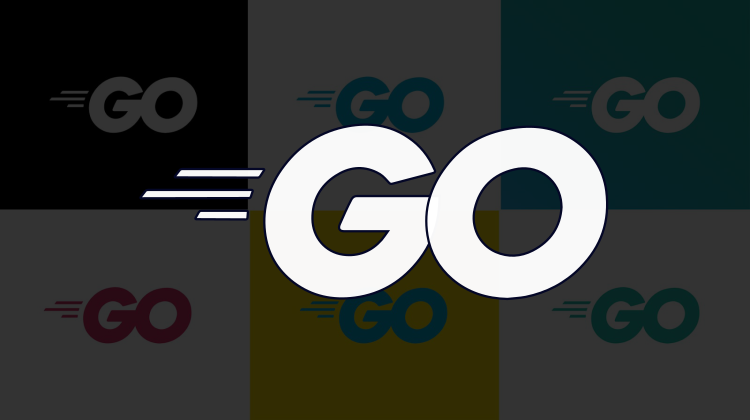

# Modern Go (Golang) - The Complete Beginners Guide 2021

Learn Go (Golang) in-depth by solving 15 Quizzes, 10 Exercises and 4 Projects.

## What you'll learn

1. Installation & Setup
2. Variables & Primitive Data Types
3. Composite Data Types
4. Control Flow
5. Functions
6. Pointers
7. Structs
8. Methods & Interfaces
9. Error Handling
10. Packages & Modules
11. Concurrency With Goroutines & Channels
12. Introduction To Testing
13. The Standard Library
14. Go Modules
15. Moving Ahead

## Requirements

1. Any prior experience with other programming languages is nice to have.

## Description

Mastering Go (Golang) - The Complete Beginners Guide is a practical course which teaches Go in a practical and easy manner, the course assumes you have some experience with other programming languages, beginner level knowledge is just fine. With this we can dive directly into Go without explaining basic stuff like what is a "variable" etc.

This is a hands-on course with 15 Quizzes, 10 Exercises & 4 Projects, this course is all you need to understand the "Go" programming language in-depth.

Go is a small and concise language that help you build fast and concurrent applications, Go offers a lot of advantages such as -

1. Easy to understand
2. Compiled language
3. Strict typing
4. Fast compilation
5. Cross platform
6. Built-in concurrency primitive
7. Can be easily deployed on cloud

This course will help you to get your foundations in place and after the course you can easily progress to more advanced concepts and explore different areas such as System Programming, Web Programming, etc.

The course also comes with help and timely resolution to your questions, the course also provides all the code links on Github, with all these we make sure you are never lost in the coding journey.
